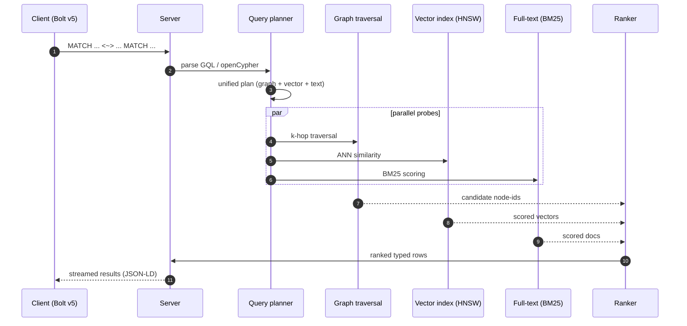
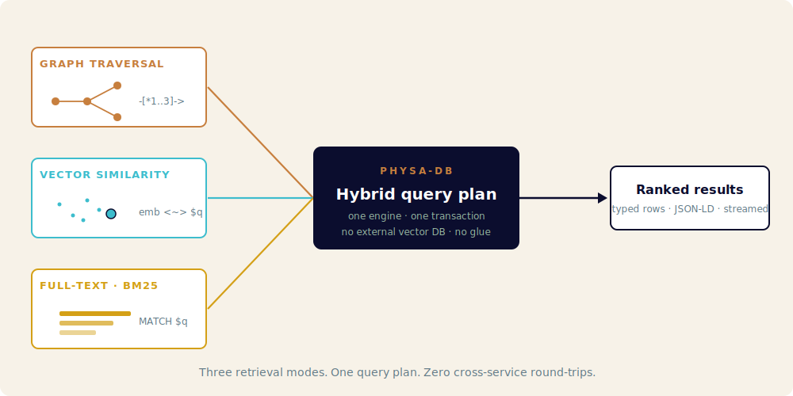
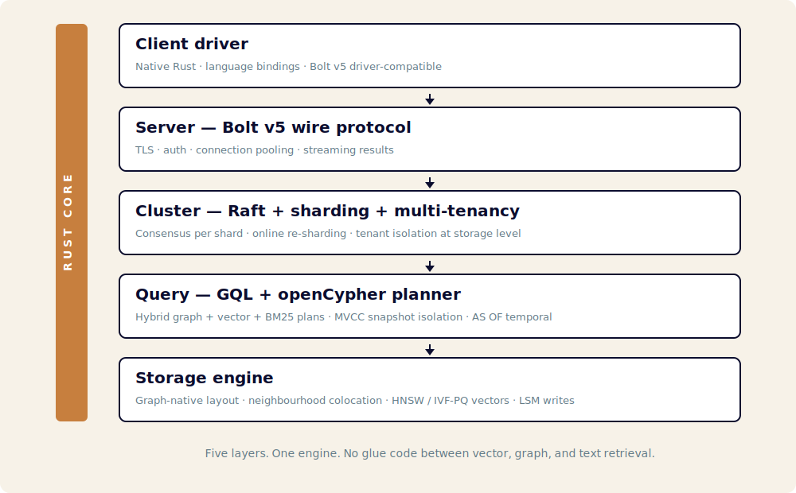

<p align="center">
  
</p>

<p align="center">
  <strong>An open-source, Rust-native graph database built for AI-agent workloads.</strong><br>
  Vector search, multi-hop retrieval, knowledge graphs, agent memory — one engine, one transaction, no glue.
</p>

<p align="center">
  <a href="https://github.com/mroche14/physa-db/actions"></a>
  
  
  
  
</p>

---


## What it does

- **Graph + vector + full-text in one query plan.** No cross-service round-trips between a graph DB, a vector DB, and a search engine. Ask for three-hop neighbourhoods ranked by embedding similarity and BM25 — one transaction, one result stream.
- **GQL (ISO/IEC 39075:2024) and openCypher.** Bolt v5 wire protocol, driver-compatible. Migration in, not lock-in.
- **Multi-tenant by construction.** Tenant isolation at the storage layer, online re-sharding, Raft per shard. Apache-2.0 end-to-end, no enterprise tier.

```cypher
-- One query. Three retrieval modes. Zero glue code.
MATCH (doc:Document)-[:CITES*1..3]->(source:Paper)
WHERE doc.embedding <~> $query_embedding < 0.2
  AND source.fulltext MATCH $keywords
RETURN source
ORDER BY score(source) DESC
LIMIT 10
```

## The hybrid query, at a glance



<p align="center"></p>

## Architecture

<p align="center"></p>

Five layers. One engine. No glue code between vector, graph, and text retrieval. Details in [`docs/architecture/`](./docs/architecture/) and the ADR series.

## Why physa-db?

### The technical reason — AI-agent-native, by design

Agentic AI systems produce workloads no 2010-era graph DB was designed for: RAG blending vectors and graph hops in one query, long-term agent memory with TTL and forgetting semantics, knowledge graphs with provenance and confidence, multi-modal asset stores, agent-trace observability, temporal reasoning with `AS OF`. Today the "solution" is to chain a vector DB + a graph DB + a blob store + an orchestration layer. That stack is brittle, slow, and expensive.

physa-db is one engine that serves those workloads natively. See [`docs/requirements/positioning.md`](./docs/requirements/positioning.md) and [`docs/requirements/ai-agent-workloads.md`](./docs/requirements/ai-agent-workloads.md).

### The commercial reason — end the pricing era

The graph database market is captive. The incumbent's licensing model makes it impossible to build a modern SaaS on top of it the way you would on Postgres. Most OSS alternatives are abandoned, non-Cypher, single-node, or slower. physa-db is Apache-2.0 end-to-end, with multi-tenancy and horizontal scaling native — no enterprise-gated features. See [`docs/requirements/positioning.md`](./docs/requirements/positioning.md) §1.

### Two pillars, one database

| Pillar | Promise |
|---|---|
| **AI-agent-native** | Dense + sparse vectors as first-class property types · HNSW / IVF-PQ indices · hybrid query plans (vector + graph + BM25) · MCP server · media blob storage with chunk hierarchy · embedding-model versioning · `AS OF` temporal queries · agent-observability ingest · streaming results · LLM-shaped output (JSON-LD, token-budget-aware truncation). |
| **Graph-DB parity** | Full **GQL (ISO/IEC 39075:2024) AND openCypher** · Bolt v5 wire protocol · ACID transactions with MVCC snapshot isolation · horizontal scaling · online re-sharding · Apache-2.0, no enterprise tier. |

AI-native features win *new* workloads that never had a good graph-DB answer. Parity features win *migrations from* the incumbent. They compound.

---


## Built by AI agents, on purpose

physa-db is **AI-agent-first** in its development workflow as well as in its feature set. Documentation, tooling, ADRs, and issue structure are shaped so AI coding agents (Claude Code, Codex, Cursor, etc.) can pick up well-scoped issues and ship PRs with minimal human intervention. Humans own vision, review, and merges; agents own implementation velocity.

See [`AGENTS.md`](./AGENTS.md) for the full agent contract — engineering-discipline rules (§11 first-principles, §12 no-shortcuts, §15 features-before-architecture) and the credential-safety protocol (§10).

## Status & dashboard

**Pre-alpha. Architecture phase. Not usable yet.** Milestone M0 (project genesis & docs) is shipping; M1 (feature lock) is next.

Public development dashboard — features in flight, benchmarks, open issues — at a GitHub Pages URL *(pending first deploy)*.

## Quick links

- [`docs/requirements/positioning.md`](./docs/requirements/positioning.md) — commercial pillar (§1) + AI-agent-native technical pillar (§§2–7)
- [`docs/requirements/ai-agent-workloads.md`](./docs/requirements/ai-agent-workloads.md) — authoritative source of the workloads driving every feature
- [`docs/requirements/feature-matrix.md`](./docs/requirements/feature-matrix.md) — public feature list with tier and ADR links
- [`docs/requirements/non-goals.md`](./docs/requirements/non-goals.md) — what physa-db explicitly is NOT
- [`AGENTS.md`](./AGENTS.md) — AI-agent contract
- [`ROADMAP.md`](./ROADMAP.md) — milestones
- [`docs/architecture/`](./docs/architecture/) — design docs & ADRs

## License

Apache-2.0. See [`LICENSE`](./LICENSE).
