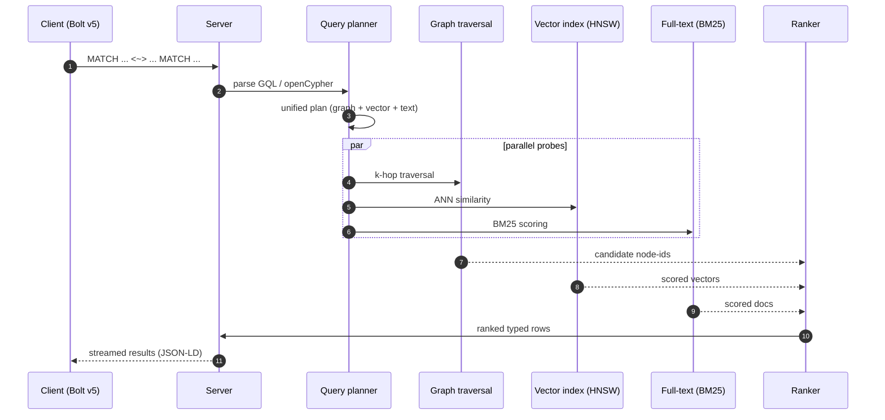
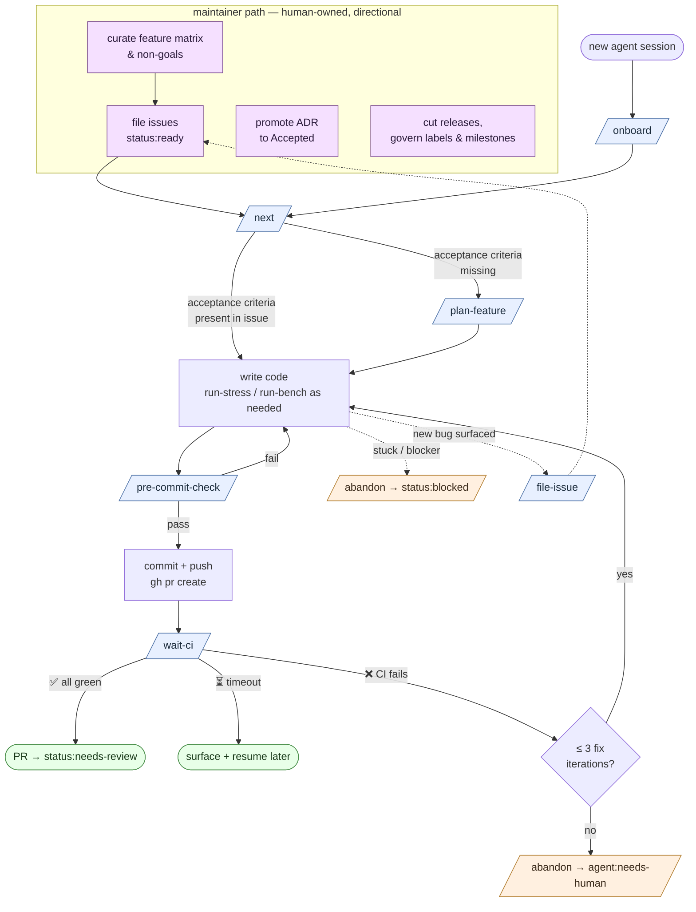

<p align="center">
  <picture>
    <source media="(prefers-color-scheme: dark)" srcset="assets/logo-dark.svg">
    
  </picture>
</p>

<p align="center">
  <strong>An open-source, Rust-native graph database built for AI-agent workloads.</strong><br>
  Vector search, multi-hop retrieval, knowledge graphs, agent memory — one engine, one transaction, no glue.
</p>

<p align="center">
  <a href="https://github.com/mroche14/physa-db/actions"></a>
  
  
  
  
</p>

---

![Top-down editorial illustration of a self-organising graph network — discrete glowing nodes ringed in cyan are connected by amber and cyan filamentous tubes that thicken at a central convergence cluster where data flows densest, and taper into exploratory tendrils probing outward. Code-line patterns are faintly etched into the dark substrate. The image evokes the project's namesake organism, Physarum polycephalum — the slime mold that solves shortest-path and resilience problems by reinforcing efficient routes and atrophying weak ones — and stands in for what physa-db does at runtime: hybrid graph + vector + full-text retrieval over an adaptive query plan, with agent memory that reinforces useful facts and lets stale ones fade.](assets/hero.jpg)

## Contents

- [What it does](#what-it-does)
- [The hybrid query, at a glance](#the-hybrid-query-at-a-glance)
- [Architecture](#architecture)
- [Why physa-db?](#why-physa-db)
- [Built by AI agents, on purpose](#built-by-ai-agents-on-purpose)
- [Getting started](#getting-started)
- [The dev loop](#the-dev-loop)
- [Status & dashboard](#status--dashboard)
- [Project labels](#project-labels)
- [Quick links](#quick-links)
- [License](#license)

## What it does

- **Graph + vector + full-text in one query plan.** No cross-service round-trips between a graph DB, a vector DB, and a search engine. Ask for three-hop neighbourhoods ranked by embedding similarity and BM25 — one transaction, one result stream.
- **GQL (ISO/IEC 39075:2024) and openCypher.** Bolt v5 wire protocol, driver-compatible. Migration in, not lock-in.
- **Multi-tenant by construction.** Tenant isolation at the storage layer, online re-sharding, Raft per shard. Apache-2.0 end-to-end, no enterprise tier.

```cypher
-- One query. Three retrieval modes. Zero glue code.
MATCH (doc:Document)-[:CITES*1..3]->(source:Paper)
WHERE doc.embedding <~> $query_embedding < 0.2
  AND source.fulltext MATCH $keywords
RETURN source
ORDER BY score(source) DESC
LIMIT 10
```

## The hybrid query, at a glance



<p align="center"></p>

## Architecture

<p align="center"></p>

Five layers. One engine. No glue code between vector, graph, and text retrieval. Details in [`docs/architecture/`](./docs/architecture/) and the ADR series.

## Why physa-db?

### The technical reason — AI-agent-native, by design

Agentic AI systems produce workloads no 2010-era graph DB was designed for: RAG blending vectors and graph hops in one query, long-term agent memory with TTL and forgetting semantics, knowledge graphs with provenance and confidence, multi-modal asset stores, agent-trace observability, temporal reasoning with `AS OF`. Today the "solution" is to chain a vector DB + a graph DB + a blob store + an orchestration layer. That stack is brittle, slow, and expensive.

physa-db is one engine that serves those workloads natively. See [`docs/requirements/positioning.md`](./docs/requirements/positioning.md) and [`docs/requirements/ai-agent-workloads.md`](./docs/requirements/ai-agent-workloads.md).

### The commercial reason — end the pricing era

The graph database market is captive. The incumbent's licensing model makes it impossible to build a modern SaaS on top of it the way you would on Postgres. Most OSS alternatives are abandoned, non-Cypher, single-node, or slower. physa-db is Apache-2.0 end-to-end, with multi-tenancy and horizontal scaling native — no enterprise-gated features. See [`docs/requirements/positioning.md`](./docs/requirements/positioning.md) §1.

### Two pillars, one database

| Pillar | Promise |
|---|---|
| **AI-agent-native** | Dense + sparse vectors as first-class property types · HNSW / IVF-PQ indices · hybrid query plans (vector + graph + BM25) · MCP server · media blob storage with chunk hierarchy · embedding-model versioning · `AS OF` temporal queries · agent-observability ingest · streaming results · LLM-shaped output (JSON-LD, token-budget-aware truncation). |
| **Graph-DB parity** | Full **GQL (ISO/IEC 39075:2024) AND openCypher** · Bolt v5 wire protocol · ACID transactions with MVCC snapshot isolation · horizontal scaling · online re-sharding · Apache-2.0, no enterprise tier. |

AI-native features win *new* workloads that never had a good graph-DB answer. Parity features win *migrations from* the incumbent. They compound.

---

![Editorial illustration of physa-db's AI multi-agent development workflow as a construction tableau. Center: a monumental pyramid representing the project codebase, lower courses solid stratified stone etched with luminous code-lattice motifs, upper courses still in scaffold and wireframe state where active work is converging at the apex. Around and on the pyramid: dozens of small stylised figures in three identifying colours — orange (Claude Code instances), teal (Codex instances), pink (Gemini instances). A small cluster on a raised platform at the lower-left stands around a planning board (the feature list), pointing toward sections of the pyramid: these are the directors. The majority are dispersed across the pyramid as executors — hauling block-shaped code fragments at the base, fitting elements on mid-level scaffolds, climbing toward the apex where the build front glows brightest. A coordinated, parallel workforce.](assets/hero-collab.jpg)

## Built by AI agents, on purpose

physa-db is **AI-agent-first** in its development workflow as well as in its feature set. Documentation, tooling, ADRs, and issue structure are shaped so AI coding agents (Claude Code, Codex, Cursor, etc.) can pick up well-scoped issues and ship PRs with minimal human intervention. Humans own vision, review, and merges; agents own implementation velocity.

See [`AGENTS.md`](./AGENTS.md) for the full agent contract — engineering-discipline rules (§11 first-principles, §12 no-shortcuts, §15 features-before-architecture) and the credential-safety protocol (§10).

## Getting started

physa-db is developed with AI coding agents — Claude Code, Codex, Cursor, or anything that honours [`.claude/skills/`](./.claude/skills/) (Codex reads the same files through [`.agents/skills/`](./.agents/skills/)). Whether you are the solo maintainer or a new external contributor, the workflow is identical: open an agent, run `/onboard`, then `/next`.

**Prerequisites:** [`mise`](https://mise.jdx.dev/) · `git` · `gh` (GitHub CLI — `/next` needs it authenticated).

```bash
git clone https://github.com/mroche14/physa-db.git
cd physa-db
claude .            # or: codex, cursor, …
```

Then, inside your agent:

1. **`/onboard`** — installs the pinned toolchain (`mise install`), verifies `gh auth`, reads rules + pillars, lists ready tasks. Run this first in every fresh session (and after any context-compaction). *(Auto-install behaviours are tracked for implementation — see [#52](https://github.com/mroche14/physa-db/issues/52) and the follow-up `/onboard` enrichment issue.)*
2. **`/next`** — claims the next `status:ready` GitHub Issue atomically, creates the `agent/<n>-<slug>` branch, and invokes `/plan-feature` if the issue has no plan yet.

That's the entry gate. The full loop (`/plan-feature` → code → `/pre-commit-check` → commit → push + PR → `/wait-ci`) plus error-recovery paths and the skills-by-moment reference live in [`CONTRIBUTING.md`](./CONTRIBUTING.md). The complete agent contract — rules §§1–15, claim protocol §6.1, skills catalog §16 — lives in [`AGENTS.md`](./AGENTS.md).

## The dev loop

Two paths, one command each as the entry point:

- **Contributor path** — you have an agent (Claude Code, Codex, Cursor, …) and tokens to burn. You run `/onboard` once per clone, then `/next` on repeat. The agent decides everything else: whether the claimed issue needs `/plan-feature` first, whether a bug surfaced mid-work warrants `/file-issue`, whether to `/abandon blocked` when stuck. You don't pick skills — the agent does. Ideal for external contributors who want to ship without reading the full contract.
- **Maintainer path** — directional work that stays human-owned: editing the [feature matrix](./docs/requirements/feature-matrix.md) (the single-source list of what physa-db will do, tier-scored, that every issue links back to), promoting Architecture Decision Records ([ADRs](./docs/architecture/adr/)) from `Proposed` to `Accepted`, governing the label/milestone taxonomy, and cutting releases. These are not automatable because they set the direction the agents then execute against.

The diagram below shows both paths in one view. Maintainers curate the issue queue on the left; contributors (or their agents) consume it on the right. Dotted edges are escape hatches the agent takes autonomously when the conditions match — including `/file-issue`, which feeds a newly-surfaced bug back into the same queue the loop consumes.



Every arrow is a skill or a standard `git` / `gh` command. Skills exist to make the AGENTS.md rules mechanical — you don't memorise them, the agent invokes them. If a skill matches the action about to happen, it's invoked (AGENTS.md §16).

See [`CONTRIBUTING.md`](./CONTRIBUTING.md) for the detailed step-by-step, the full skills-by-moment reference, and what to do when a step fails. The complete agent contract — rules §§1–15, claim protocol §6.1, clean-repo invariant §6.2, skills catalog §16 — lives in [`AGENTS.md`](./AGENTS.md).

## Status & dashboard

**Pre-alpha. Architecture phase. Not usable yet.** Milestone M0 (project genesis & docs) is shipping; M1 (feature lock) is next.

Public development dashboard — features in flight, benchmarks, open issues — at a GitHub Pages URL *(pending first deploy)*.

## Project labels

Issue labels are declared in [`.github/labels.yml`](./.github/labels.yml) and reconciled by the `sync-labels` workflow on `main`. The workflow creates missing labels and updates declared metadata, but it never deletes stray labels automatically.

To propose a new label, open a PR that updates both [`.github/labels.yml`](./.github/labels.yml) and the canonical table in [`AGENTS.md`](./AGENTS.md) §6. Include the prefix, color, description, and why the existing taxonomy cannot express the work.

## Quick links

- [`docs/requirements/positioning.md`](./docs/requirements/positioning.md) — commercial pillar (§1) + AI-agent-native technical pillar (§§2–7)
- [`docs/requirements/ai-agent-workloads.md`](./docs/requirements/ai-agent-workloads.md) — authoritative source of the workloads driving every feature
- [`docs/requirements/feature-matrix.md`](./docs/requirements/feature-matrix.md) — public feature list with tier and ADR links
- [`docs/requirements/non-goals.md`](./docs/requirements/non-goals.md) — what physa-db explicitly is NOT
- [`AGENTS.md`](./AGENTS.md) — AI-agent contract
- [`ROADMAP.md`](./ROADMAP.md) — milestones
- [`docs/architecture/`](./docs/architecture/) — design docs & ADRs

## License

Apache-2.0. See [`LICENSE`](./LICENSE).
